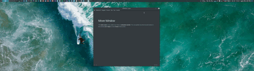

# Move Window

This **kwin script** is very useful if you have an **ultrawide monitor**. You can quickly move the focused window to the extreme **Left** / **Right** or in the **Center** of the screen.



## Install

```bash
# clone the repository
https://github.com/sergiupopescu199/moveWindow.git
# enter in the cloned repository
cd moveWindow
# install the kwin-script
plasmapkg2 --type=kwinscript -i .
# the files will be installed in /home/<user>/.local/share/kwin/scripts/moveWindow
```

## Remove

```bash
# list all your installed kwin scripts and search for 'moveWindow'
kpackagetool5 --type KWin/Script --list
# uninstall
kpackagetool5 --type KWin/Script --remove moveWindow
```

## Usage 

|  Shortcuts   |             Commands              |
| :----------: | :-------------------------------: |
| `Meta` + `X` |  Move focused window to **Left**  |
| `Meta` + `C` | Move focused window to **Center** |
| `Meta` + `V` | Move focused window to **Right**  |

